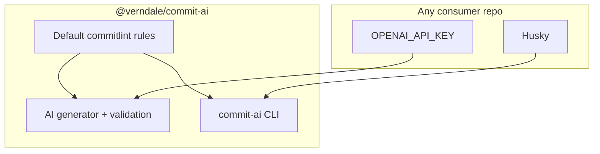

# @verndale/commit-ai — portable AI commits + commitlint

## Scope (explicit)

- **All implementation lives in** [github.com/verndale/commit-ai](https://github.com/verndale/commit-ai). **This plan does not require changes to Build-Orchestration** or any other consuming repo.
- **No repo-specific presets** (no `frontend-ai/`, no “build-orchestration” migration). Optional consumer overrides live in **their** project via documented extension points only.

## Goals

- **One install** (`@verndale/commit-ai`) gives:
  - AI-assisted commit messages aligned to **the same** Conventional Commit rules enforced by commitlint.
  - **Bundled commitlint** (`@commitlint/cli` + config) so consumers do **not** separately add `@commitlint/cli` unless they want a second tool; hooks can call the packaged binary.
- **Minimal setup in any project**: devDependency + `OPENAI_API_KEY` + either **copy-paste hooks** (v1 README) or `**commit-ai init`** (Phase 2) to generate them.

## Architecture

- **Single source of truth**: one **default rules module** in the package defines allowed types, scope policy (e.g. path-derived `repo` / `docs` / package name—**generic**, not tied to a specific codebase layout), subject/body/footer limits, and breaking-change behavior. Both **commitlint config** (or programmatic `load` of the same rules) and **AI prompt + `validateHeader`** read from this module so they cannot drift.
- **commitlint**: ship as **dependencies** of `@verndale/commit-ai`. Expose linting via:
  - `commit-ai lint --edit "$1"` (or similar) that invokes commitlint with the **packaged** config path, **or**
  - export `commitlint` preset path for `extends: ['@verndale/commit-ai']` style (document both; pick one primary UX for “least setup”).

## CLI surface (v1)

| Command                                        | Purpose                                                                 |
| ---------------------------------------------- | ----------------------------------------------------------------------- |
| `commit-ai run`                                | Generate message from staged diff + `git commit -F -`.                  |
| `commit-ai prepare-commit-msg <file> [source]` | Git `prepare-commit-msg` hook: fill empty template; respect merge skip. |
| `commit-ai lint --edit <file>`                 | Git `commit-msg` hook: run commitlint with **package default** config.  |

Load **dotenv** from `process.cwd()` inside the CLI for `OPENAI_API_KEY`.

## Optional consumer config (advanced)

- Document how to **extend** the default (e.g. stricter `scope-enum`, extra types) via a small `commit-ai.config.`* or `package.json` field **only if** v1 needs overrides; if that adds complexity, v1 can ship **defaults only** + “fork the config pattern” in README for power users.

## Repository layout (verndale/commit-ai)

- `package.json` — `name`, `bin`, `files`, `dependencies` (openai, dotenv, @commitlint/cli, @commitlint/config-conventional or custom rules on top), `engines`.
- `bin/cli.js` — subcommands `run`, `prepare-commit-msg`, `lint`; Phase 2 adds `init`.
- `lib/rules.js` (or split) — shared types, scope resolution (generic), validation used by generator + exported for commitlint preset.
- `lib/commitlint-preset.cjs` — `module.exports` for commitlint; **extends** conventional + overrides from `lib/rules.js`.
- `lib/core/`* — git helpers, OpenAI, wrapping, fallback subject when API fails.
- `README.md` — install, env, copy-paste Husky snippets (`prepare-commit-msg`, `commit-msg`), npm scripts example (`"commit": "commit-ai run"`).

## Publishing

- Align **LICENSE** with package metadata (MIT per existing repo).
- `npm publish` under `@verndale` with appropriate access.

## Testing / QA (in commit-ai repo)

- Smoke-test in a **throwaway** git repo: stage a change, `commit-ai run`, then `commit-ai lint --edit` on the message file (or full hook flow).
- Large diff: retain generous `execSync` `maxBuffer` behavior.

## Phase 2: `commit-ai init` (recommended follow-up)

**Yes, it makes sense** to add this after the core CLI ships: it matches the “drop into any project” goal and avoids hand-editing shell scripts. Keep it **Phase 2** so v1 is not blocked on Husky/version-manager edge cases (pnpm vs npm, existing hooks, Windows shims).

**Suggested behavior:**

- Idempotent: safe to run twice; detect existing `commit-ai` lines and skip duplicates or offer merge.
- Ensure **Husky** is present: if no `.husky/` or `prepare` script missing, run `husky init` or document adding `husky` + `"prepare": "husky"` (prefer **peerDependency** `husky` + optional `init` that shells out to `npx husky init` when user confirms).
- Write `**.husky/prepare-commit-msg`** calling `commit-ai prepare-commit-msg "$1" "$2"` (use `npx`/`pnpm exec`/`yarn` based on lockfile detection or a `--pm` flag).
- Write `**.husky/commit-msg`** calling `commit-ai lint --edit "$1"` (same binary resolution).
- Optionally add `**package.json` scripts**: `"commit": "commit-ai run"` (merge, do not overwrite unrelated scripts).
- Print next steps: add `OPENAI_API_KEY` to `.env`, run `git add` / `pnpm commit`.

**Out of scope (entire project):** PR automation, semantic-release, anything outside commit message + lint + optional init.